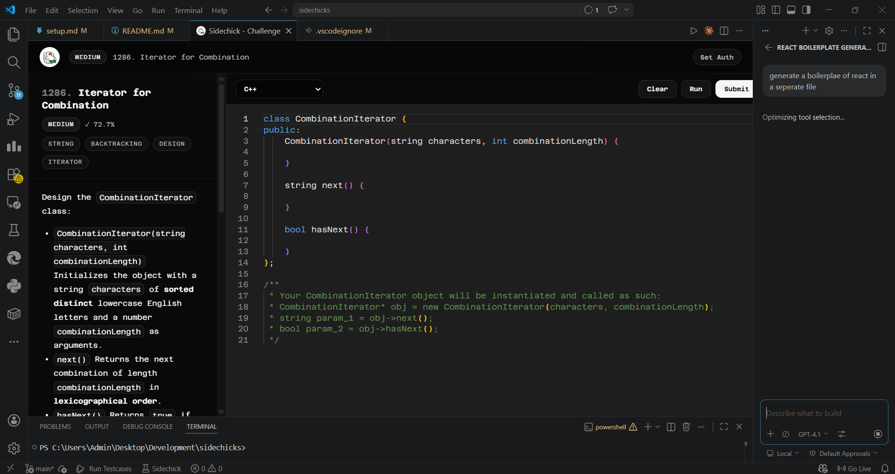
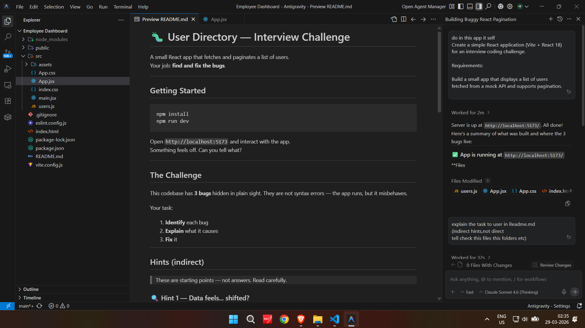

# SideChick

**Parallel execution for your brain.**

You hired an AI to write code, but what do you do while it thinks? SideChick turns AI generation time into skill-building time. Whenever your AI assistant starts executing a task, SideChick pops up a seamless, parallel challenge in your editor. Solve a quick LeetCode problem or debug a broken MERN app while you wait. Maximize your downtime and never lose your momentum.

>
>
---

## The idea

AI pair programmers are fast. You should be too.

SideChick intercepts your session the moment an AI tool kicks in and opens a challenge flow in parallel. Pass it, and the AI is yours. Dismiss it, and your streak resets. Simple.

---

## Two challenge modes

### DSA mode

Pick a LeetCode problem, solve it in VS Code, submit for a real verdict.

- Fetches a real LeetCode problem via the GraphQL API
- Renders the full problem statement inside a VS Code themed webview
- Gives you a Monaco editor with starter code when LeetCode provides it
- Submits using your `LEETCODE_SESSION` and `csrftoken`
- Polls for the verdict and shows a pass or fail overlay

>

### Dev mode

Open a broken project in a fresh VS Code window and fix it before the AI does.

- Opens a bug-fix challenge in a new VS Code window
- Prefers remote admin-uploaded challenges from the backend
- Falls back to bundled local problems if the backend is empty
- Hides the test folder by default so you cannot peek
- Evaluates with `npm test`

>

---

## Score backend

SideChick ships with a lightweight Express + SQLite backend that:

- Stores users and challenge results
- Returns solved counts and streaks
- Serves remote Dev problem archives
- Supports admin-only uploads for new Dev problems

---

## Commands

| Command | What it does |
|---|---|
| `Sidechick: Start Challenge` | Opens the mode picker and starts a challenge |
| `Sidechick: Configure LeetCode Auth` | Stores your LC session cookie and csrf token |
| `Sidechick: Start MERN Bug Mode` | Directly opens a Dev mode bug-fix challenge |

---

## Notes

- Dev mode always opens in a new VS Code window
- DSA mode runs inside the custom challenge panel in the current window
- The webview and panel use the SideChick icon and monochrome branding

---

## Two challenge modes

### DSA mode

Pick a LeetCode problem, solve it in VS Code, submit for a real verdict.

- Fetches a real LeetCode problem via the GraphQL API
- Renders the full problem statement inside a VS Code themed webview
- Gives you a Monaco editor with starter code when LeetCode provides it
- Submits using your `LEETCODE_SESSION` and `csrftoken`
- Polls for the verdict and shows a pass or fail overlay

>

### Dev mode

Open a broken project in a fresh VS Code window and fix it before the AI does.

- Opens a bug-fix challenge in a new VS Code window
- Prefers remote admin-uploaded challenges from the backend
- Falls back to bundled local problems if the backend is empty
- Hides the test folder by default so you cannot peek
- Evaluates with `npm test`

>

---

## Score backend

SideChick ships with a lightweight Express + SQLite backend that:

- Stores users and challenge results
- Returns solved counts and streaks
- Serves remote Dev problem archives
- Supports admin-only uploads for new Dev problems

---

## Commands

| Command | What it does |
|---|---|
| `Sidechick: Start Challenge` | Opens the mode picker and starts a challenge |
| `Sidechick: Configure LeetCode Auth` | Stores your LC session cookie and csrf token |
| `Sidechick: Start MERN Bug Mode` | Directly opens a Dev mode bug-fix challenge |

---

## Notes

- Dev mode always opens in a new VS Code window
- DSA mode runs inside the custom challenge panel in the current window
- The webview and panel use the SideChick icon and monochrome branding

